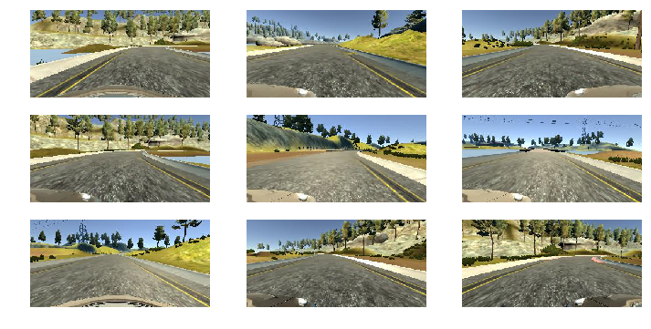
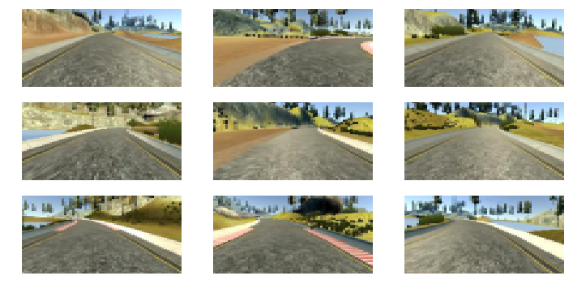
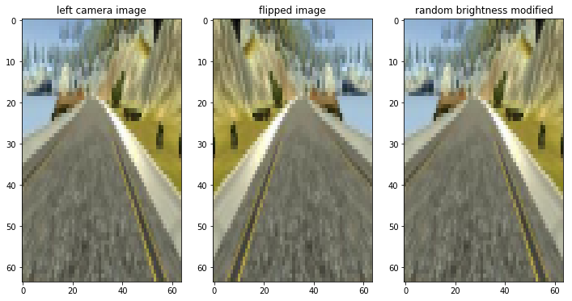
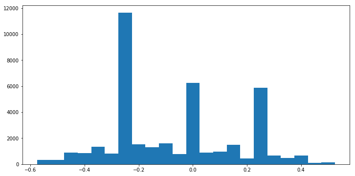
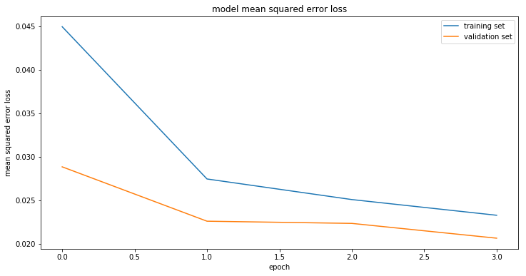

# Behaviorial Cloning
## Project 3

In this project 3 different models (LeNet, Nvidia and a basic model) are implemented and tested on the data set. NVIDIA NetWork is with some modifications is chosed to get the best accuracy. Model is trained on Amazon Web Service EC2 instance. 


```python
import cv2
import csv
import numpy as np
import os
import sklearn
from sklearn.model_selection import train_test_split
import matplotlib.mlab as mlab
import matplotlib.pyplot as plt
import matplotlib.image as mpimg
import math

def ResizeImage(image):
    shape = image.shape
    image = image[math.floor(shape[0]/5):shape[0]-25, 0:shape[1]]
    image = cv2.resize(image,(64,64),interpolation=cv2.INTER_AREA)
    return image

def augment_brightness(image):
    image = cv2.cvtColor(image,cv2.COLOR_BGR2HSV)
    image = np.array(image, dtype = np.float64)
    random_bright = .25+np.random.uniform()         # 0.5
    image[:,:,2] = image[:,:,2]*random_bright
    image[:,:,2][image[:,:,2]>255]  = 255
    image = np.array(image, dtype = np.uint8)
    image = cv2.cvtColor(image,cv2.COLOR_HSV2BGR)
    return image

def flip_data(image, steering_angle):
    steering_angle = (steering_angle * - 1.0)
    image = cv2.flip(image, 1)
    return image, steering_angle

def augment_image(image):
    flip_prob = np.random.random()
    if flip_prob > 0.4:
        image = augment_brightness(image)
        #image = cv2.GaussianBlur(image, (3,3), 0)
        #image = cv2.cvtColor(image, cv2.COLOR_BGR2YUV)
    return image
```

## Loading data 
I had a very hard time balancing the angles. The original data was heavily biased toward 0. Augmenting angles with right/left cameras was not enough. The steering angles would be still very biased toward 0 and after that majority of data was distributed toward left. 
I tried different methods to balance the data. I excluded small angles and include them only with specific probability. However this method didn't helped me much, so ended up keeping almost all of my data. That absolutely made sence to decide different approches as I couldn't collect more clean data by driving in simulator using my laptop. I figured I am a horrible simluator driver. So I decided to do something else in my Image generator.


```python
samples = []
with open ('data/driving_log.csv') as csvfile:
    reader = csv.reader(csvfile)
    for line in reader:
        samples.append(line)

del(samples[0])
print("Original Data set has ", len(samples),"lines.")
print("Each line includes 3 camera images directories, related steering angle and some extra unused information.")

steering = []
balanced_data = []

for lines in samples:
    angle = float(lines[3])
    if abs(angle) >= 0.0001:  #0.25
        steering.append(float(lines[3]))
        balanced_data.append(lines)
    elif np.random.random() > 0.0: #0.9
        steering.append(float(lines[3]))
        balanced_data.append(lines)


samples = balanced_data

#print("Data set size after excluding data related to some 0 steering angles is", len(samples))

train_samples, validation_samples = train_test_split(samples, test_size=0.2)

plt.hist(steering, bins=[-0.55, -0.5, -0.45, -0.4, -0.35, -0.3,-0.25, -0.2, -0.15, -0.1,-0.05, 0, 0.05, 0.1,0.15, 0.2,0.25, 0.3, 0.35, 0.4, 0.45, 0.5, 0.55], align='left')
plt.show()


```

    Original Data set has  8036 lines.
    Each line includes 3 camera images directories, related steering angle and some extra unused information.


## Original data set image visualization
Here I have selected 9 random images from one of the randomly selected cameras to display how the original image set looks like before data augmentation. 
The size of each image is 160 by 320 pixels in 3 channels.


```python
plt.rcParams['figure.figsize'] = (12, 6)
for i in range(9):
    rand_index = np.random.randint(len(samples)-1)
    rand_img_camera = np.random.randint(3)
    rand_sample_directory = samples[rand_index]
    rand_img =  mpimg.imread('data/'+rand_sample_directory[rand_img_camera].strip())
    plt.subplot(3, 3, i+1)
    plt.imshow(rand_img, aspect='auto')
    plt.axis('off')
plt.show()
```





# Visualization of Preprocessed and Augmented data:

## Resizing Images:
I changed the size of images to 64 by 64 just to help training model on my laptop without using AWS GPU and save some time and money on that part. However this comes automatically with the benefit of removed lower pixels that were including the hood of the car as well as the a portion of top of the image which carries pixels of the sky and far away view. The hood of the car and sky adds no sueful information to train the model. So removing these parts will help to train teh CNN faster. 
Later I will be removing another 5 pixels from top of images, in my model.


```python
plt.rcParams['figure.figsize'] = (12, 6)
for i in range(9):
    rand_index = np.random.randint(len(samples)-1)
    rand_img_camera = np.random.randint(3)
    rand_sample_directory = samples[rand_index]
    rand_img =  mpimg.imread('data/'+rand_sample_directory[rand_img_camera].strip())
    plt.subplot(3, 3, i+1)
    plt.imshow(ResizeImage(rand_img), aspect='auto')
    plt.axis('off')
plt.show()
```





## Flipping Images and Angles and Random Birghtness
While I do flipp and change the brightness of my samples in my generator, here I have selected some random images from left camera to visualize the effects of these actions on the data.


```python
plt.rcParams['figure.figsize'] = (12, 6)
angle = 0
flip_angle = 0
for i in range(3):
    rand_index = np.random.randint(len(samples)-1)
    rand_sample_directory = samples[rand_index]   
    rand_img = ResizeImage(mpimg.imread('data/'+rand_sample_directory[2].strip()))    
    angle = float(rand_sample_directory[3]) + 0.25
    flip_img, flip_angle = flip_data(rand_img, angle)

    plt.figure(1)
    plt.subplot(131)
    plt.imshow(rand_img, aspect='auto')
    plt.title('left camera image')
    
    plt.subplot(132)
    plt.imshow(flip_img, aspect='auto')
    plt.title('flipped image')
    
    plt.subplot(133)
    plt.imshow(augment_image(rand_img), aspect='auto')
    plt.title('random brightness modified')
    
print("steering angle for the left camera is", angle)
print("flipped steering angle is: ", flip_angle)  
plt.show()
```

    steering angle for the left camera is 0.19024280999999998
    flipped steering angle is:  -0.19024280999999998





## Image Generator
One of the best ways to collect more data, is to augment the data that we already have. Here are the steps I took to augment and balance the data:
1. Appended all three camera images, and augmented the angle for left/right camera's with adding a specific correction factor. This step helps the model to learn how to recover from going off the road, by simply having three camera views and steering angles.
2. Fliped images and angles and appened new flipped images and angles. This step also helps model with compensating for biased angles mostly toward left angles, just because the data has been recorded only for when the car is driving in counter clock wise in the track. Flipping images and steering angles, mimics the data for driving on the oppoiste direction. 
3. I also randomly changed the brightness of images to augment more data, mimicing driving in different conditions, like day/night.


However after spending so much time on augmenting and balancing data I figured, augmenting only the left images and steering angles is helping, since the original data is already biased toward driving left. flipping left images/steering angles compensates for lack of right camera data. 


```python
def generator(samples, batch_size=32):
    num_samples = len(samples)

    while 1:
        
        sklearn.utils.shuffle(samples)
        for offset in range(0, num_samples, batch_size):
            
            batch_samples = samples[offset:offset+batch_size]
            images = []
            angles = []
            for batch_sample in batch_samples:

                name1 = 'data/IMG/' + batch_sample[0].split('/')[-1]
                name2 = 'data/IMG/' + batch_sample[1].split('/')[-1]
                name3 = 'data/IMG/' + batch_sample[2].split('/')[-1]
                
                correction = 0.25
                center_angle = float(batch_sample[3])
                left_angle = center_angle + correction
                if left_angle > 1:
                    lef_angle = 1
                right_angle = center_angle - correction
                if right_angle < -1:
                    right_angle = -1
            
                # load the original images from three cameras
                center_image = cv2.imread(name1)
                left_image = cv2.imread(name2)
                right_image = cv2.imread(name3)

                #Resize images to 64*64
                center_image = ResizeImage(center_image)
                left_image = ResizeImage(left_image)
                right_image = ResizeImage(right_image)

                #append original images for all three cameras
                images.append(center_image)
                images.append(left_image)
                images.append(right_image)
                
                #append corrected angles for all three cameras
                angles.append(center_angle)
                angles.append(left_angle)
                angles.append(right_angle)
                

                #flip right and left images and angles
                left_image, left_angle = flip_data(left_image, left_angle)
                #right_image, right_angle = flip_data(right_image, right_angle)

                #append flipped angles
                angles.append(left_angle)
                #angles.append(right_angle)
                
                #append flipped images
                images.append(left_image)
                #images.append(right_image)
                
                #randomly change the brightness of images
                #Blur all images and change their color-sapce YUV
                for image in images:
                    image = augment_image(image)
    
            X_train = np.array(images)
            y_train = np.array(angles)
            
            (X_train, y_train)= sklearn.utils.shuffle(X_train, y_train)
            yield (X_train, y_train)

train_generator = generator(train_samples, batch_size=32)
validation_generator = generator(validation_samples, batch_size=32)

print("Data is loaded")  

```

    Data is loaded


### Distribution of steering angles yeld by generator
This is the histogram of steering angles after all the augmentation and data balancing.


```python

num_samples = len(samples)
samples_generated = 0
steering_angles = None
while samples_generated < 5*num_samples:
    X_batch, y_batch = next(train_generator)
    if steering_angles is not None:
        steering_angles = np.concatenate([steering_angles, y_batch])
    else:
        steering_angles = y_batch
    samples_generated += y_batch.shape[0]

plt.hist(steering_angles,bins=[-0.55,-0.5, -0.45, -0.4, -0.35, -0.3,-0.25, -0.2, -0.15, -0.1,-0.05,0,0.05, 0.1,0.15, 0.2,0.25, 0.3, 0.35, 0.4, 0.45, 0.5, 0.55], align='left')
plt.show()

```





# Building Basic Model

This model is going to be a flattened image connected to a single output node. This single output node is going to predict the steering angle, which makes this a regression network.

For a Classification Netwrok we might need to apply a softmax activation function to the output layer. But for a regression network like this we just need a single output node to directly predict the steering angle for us.

I decided to use NVIDIA atrtichecture to start with. I added two dropout layers after 1st and 3rd convolutional layers. Normalizing and cropping the images, were 2 good points that I learn from the lectures. 
Since I resized my images and also cropped the top of resized images I had to change the size of filters. I also learn that I can debug the sizing issues in keras simply by using model.summary() function.  


```python
from keras.models import Sequential
from keras.layers import Flatten, Dense, Lambda, Dropout, Input
from keras.layers import Convolution2D
from keras.layers.pooling import MaxPooling2D
from keras.layers import Cropping2D
from keras.models import Model
import matplotlib.pyplot as plt
from keras.layers.pooling import AveragePooling2D


model = Sequential()
model.add(Lambda(lambda x: x / 255.0 - 0.5, input_shape=(64,64,3), output_shape=(64,64,3)))
model.add(Cropping2D(cropping=((5,0), (0,0)), input_shape=(64,64,3)))
model.add(Convolution2D(24,3,3, subsample=(2,2), activation="elu"))#5
model.add(Dropout(0.5))
model.add(Convolution2D(36,3,3, subsample=(2,2), activation="elu"))
model.add(MaxPooling2D())
model.add(Convolution2D(48,3,3, subsample=(2,2), activation="elu"))
model.add(Dropout(0.5))
model.add(Convolution2D(64,1,1, activation="elu"))#3
model.add(Convolution2D(64,1,1, activation="elu"))
model.add(Flatten())
model.add(Dense(100))
model.add(Dense(50))
model.add(Dense(10))
model.add(Dense(1))
model.summary()


```

    Using TensorFlow backend.


    ____________________________________________________________________________________________________
    Layer (type)                     Output Shape          Param #     Connected to                     
    ====================================================================================================
    lambda_1 (Lambda)                (None, 64, 64, 3)     0           lambda_input_1[0][0]             
    ____________________________________________________________________________________________________
    cropping2d_1 (Cropping2D)        (None, 59, 64, 3)     0           lambda_1[0][0]                   
    ____________________________________________________________________________________________________
    convolution2d_1 (Convolution2D)  (None, 29, 31, 24)    672         cropping2d_1[0][0]               
    ____________________________________________________________________________________________________
    dropout_1 (Dropout)              (None, 29, 31, 24)    0           convolution2d_1[0][0]            
    ____________________________________________________________________________________________________
    convolution2d_2 (Convolution2D)  (None, 14, 15, 36)    7812        dropout_1[0][0]                  
    ____________________________________________________________________________________________________
    maxpooling2d_1 (MaxPooling2D)    (None, 7, 7, 36)      0           convolution2d_2[0][0]            
    ____________________________________________________________________________________________________
    convolution2d_3 (Convolution2D)  (None, 3, 3, 48)      15600       maxpooling2d_1[0][0]             
    ____________________________________________________________________________________________________
    dropout_2 (Dropout)              (None, 3, 3, 48)      0           convolution2d_3[0][0]            
    ____________________________________________________________________________________________________
    convolution2d_4 (Convolution2D)  (None, 3, 3, 64)      3136        dropout_2[0][0]                  
    ____________________________________________________________________________________________________
    convolution2d_5 (Convolution2D)  (None, 3, 3, 64)      4160        convolution2d_4[0][0]            
    ____________________________________________________________________________________________________
    flatten_1 (Flatten)              (None, 576)           0           convolution2d_5[0][0]            
    ____________________________________________________________________________________________________
    dense_1 (Dense)                  (None, 100)           57700       flatten_1[0][0]                  
    ____________________________________________________________________________________________________
    dense_2 (Dense)                  (None, 50)            5050        dense_1[0][0]                    
    ____________________________________________________________________________________________________
    dense_3 (Dense)                  (None, 10)            510         dense_2[0][0]                    
    ____________________________________________________________________________________________________
    dense_4 (Dense)                  (None, 1)             11          dense_3[0][0]                    
    ====================================================================================================
    Total params: 94,651
    Trainable params: 94,651
    Non-trainable params: 0
    ____________________________________________________________________________________________________


```python
model.compile(loss='mse', optimizer='adam')

# Once the model is compiled we'll train the feature and label arrays
# we just build.
# WE also shuffle the data and also split off 20% of the data to use 
# for validation set.

history_object = model.fit_generator(train_generator, samples_per_epoch =
5*len(train_samples), validation_data =
    validation_generator,
    nb_val_samples = len(validation_samples), 
    nb_epoch=4, verbose=1)

### print the keys contained in the history object
print(history_object.history.keys())

### plot the training and validation loss for each epoch
plt.plot(history_object.history['loss'])
plt.plot(history_object.history['val_loss'])
plt.title('model mean squared error loss')
plt.ylabel('mean squared error loss')
plt.xlabel('epoch')
plt.legend(['training set', 'validation set'], loc='upper right')
plt.show()
# Now we will save the model and download it onto our local machine,
# and see if it works for driving the simulator.

model.save('model.h5')
print("model saved!")
exit()

```

    Epoch 1/4
    32112/32140 [============================>.] - ETA: 0s - loss: 0.0450

    /Users/aramhamidi/anaconda/envs/carnd-term1/lib/python3.5/site-packages/keras/engine/training.py:1569: UserWarning: Epoch comprised more than `samples_per_epoch` samples, which might affect learning results. Set `samples_per_epoch` correctly to avoid this warning.
      warnings.warn('Epoch comprised more than '


    32240/32140 [==============================] - 132s - loss: 0.0450 - val_loss: 0.0288
    Epoch 2/4
    32224/32140 [==============================] - 112s - loss: 0.0274 - val_loss: 0.022
    Epoch 3/4
    32240/32140 [==============================] - 120s - loss: 0.0251 - val_loss: 0.022
    Epoch 4/4
    32240/32140 [==============================] - 111s - loss: 0.0233 - val_loss: 0.020
    dict_keys(['loss', 'val_loss'])





    model saved!


Reading a very useful article about traingin models with unbalanced data, I learned that training and validation loss aren't really good metrics to decide whether the model is doing good or not. So after that I tried my model on autnomous mode of the simulator each time to observe the behaviour of the car. Surprisingly, whenever my model validation/training loss were looking too good, my model performed poorly! The last time I trained it, the model loss didn't seem so prommising but the car passed the test.

# Few insights: 
Machine learning involves trying out ideas and testing them to see if they work. Whatever that works for someone else might not be working well for me! 
1. despretly going through the forum relized that some people have got fantastic results using YUV color sapce and bluring the images. I spend so much time doing the same. At first I got better results but everntually I relized those two steps aren't much helping me. I assume that it was because I was also resizing my images to a much smaller pixels 64 by 64.
2. validation/training loss aren't always the best metrics to evaluate the model. 
3. training a model with unbalanced data is very challenging. I learned different great methods of augmenting and balancing a data set.
4. Dropout layers although helpful but if too many can cause overfitting.
5. When using generators, we have to be careful about samples_per_epoch with augmented data! 

